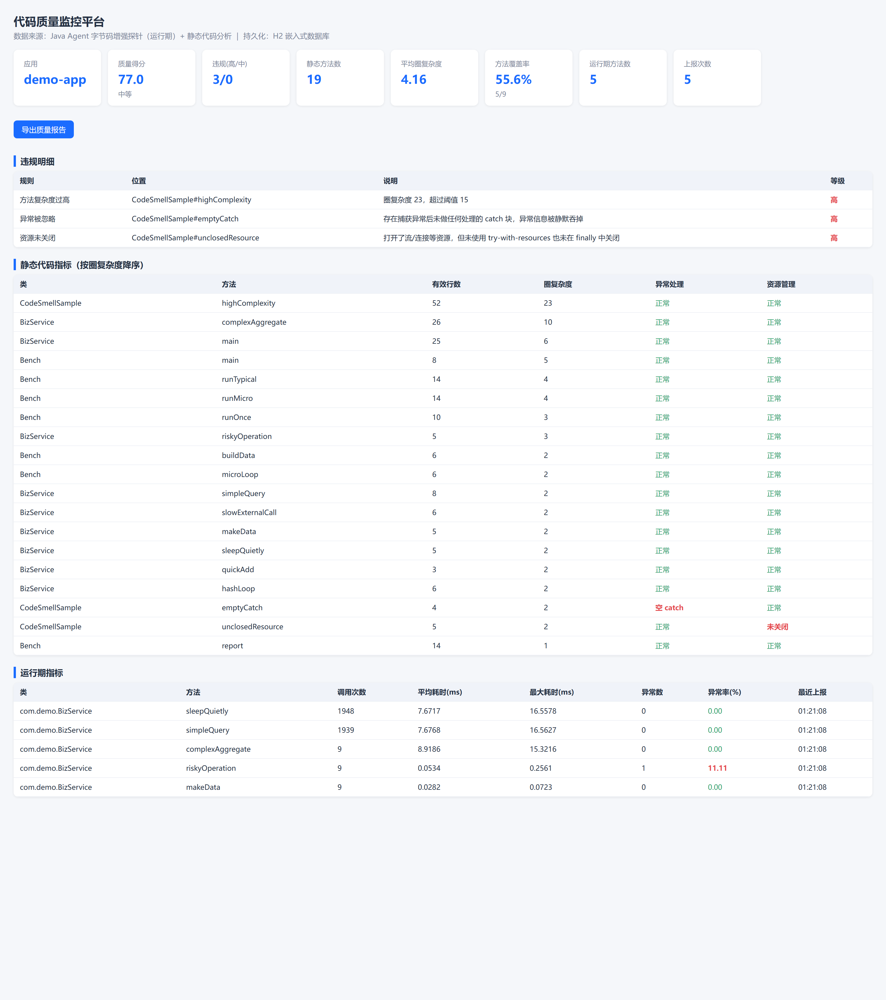
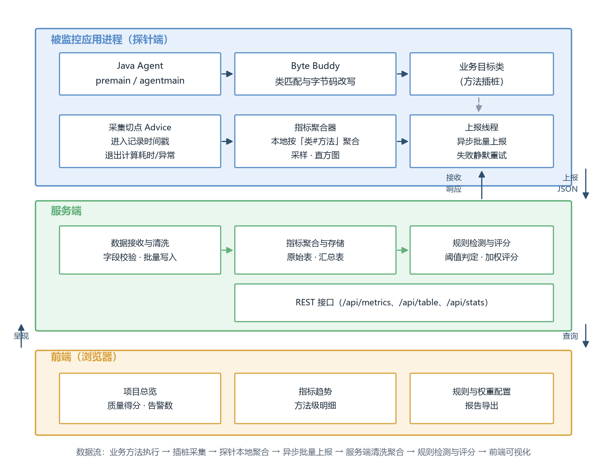

# YiyangzaiCQM

**基于 Java 字节码增强技术的代码质量监控平台**

[](https://github.com/969246694/YiyangzaiCQM/actions/workflows/build.yml)
[](LICENSE)
[](#环境要求)

以一个 **Java Agent** 探针在类加载阶段对目标类做方法级插桩，在**不修改业务源码、不重新编译、
不重启应用**的前提下采集方法调用次数、执行耗时与异常抛出等运行期数据；
同时结合静态代码分析（圈复杂度、方法规模、异常处理与资源管理规范性），
按可配置规则检测违规并计算项目质量得分。

> 在线演示：<https://yiyangzai.cn/cqm/> — 页面上是**实时数据**，非截图



---

## 特性

- **无侵入采集** — 以 `-javaagent` 挂载，业务代码零改动；匹配器显式排除构造方法与静态初始化块，避免插桩失败
- **静态 + 动态融合** — 静态结构指标与运行期行为指标在同一平台聚合、检测、评分
- **可控开销** — 采样、探针端本地聚合、异步批量上报三重降开销措施；实测单次调用固定开销约 **0.107 µs**，毫秒级业务方法上额外耗时占比约 **0.1%**
- **开箱即用** — 只需一个 JDK，无需 Maven / Gradle；`build.sh` 仅用 JDK 自带的 `javac` 与 `jar`
- **可配置规则与权重** — 6 条内置规则，阈值与评分权重均可通过 `-D` 覆盖
- **安全设计** — 写操作令牌校验 + 静态分析路径限制 + 反向代理层封禁写接口

---

## 架构



```
业务应用（被监控）
  ├─ JVM 启动：-javaagent:cqm-agent.jar
  └─ Byte Buddy 在类加载阶段对 com.yourcompany.* 插桩
        ↓ 探针端本地聚合（按"类#方法"压缩），异步批量上报
服务端（JDK HttpServer + H2）
  ├─ 数据接收 → 清洗 → 落库
  ├─ 静态分析（源码）→ 规则检测 → 质量评分
  └─ REST 接口 + 可视化页面
```

---

## 快速开始

### 1. 构建

```bash
git clone https://github.com/969246694/YiyangzaiCQM.git
cd YiyangzaiCQM
./build.sh          # Windows 用 build.bat
```

构建产物：`agent/cqm-agent.jar`、`agent/cqm-agent-bootstrap.jar`、`out/server`、`out/demo`。

### 2. 启动服务端

```bash
cd out && java -Dcqm.src=../demo/src \
  -cp "server:../lib/h2-2.2.224.jar" com.cqm.server.Server 8080
```

打开 <http://127.0.0.1:8080/>。

### 3. 给目标应用挂载探针

```bash
java -javaagent:/path/to/agent/cqm-agent.jar \
     -Dcqm.packages=com.yourcompany \
     -Dcqm.server=http://127.0.0.1:8080 \
     -Dcqm.app=your-app \
     -jar your-app.jar
```

> 想先看效果？运行 `./run-demo.sh` 会以探针方式跑起内置示例应用。

---

## 探针配置项

| 参数 | 默认值 | 说明 |
|---|---|---|
| `cqm.packages` | `com.demo` | **需要插桩的包前缀**，逗号分隔 |
| `cqm.exclude` | `com.cqm,net.bytebuddy,java.,javax.,sun.,jdk.,com.sun.` | 排除的包前缀，优先级更高 |
| `cqm.server` | `http://127.0.0.1:8080` | 服务端地址 |
| `cqm.interval` | `5000` | 上报周期（毫秒） |
| `cqm.sample` | `1.0` | 采样率 0~1，高流量场景可下调 |
| `cqm.app` | `demo-app` | 应用名（显示在监控页面） |
| `cqm.token` | 空 | 写操作令牌 |
| `cqm.debug` | `false` | 探针调试日志 |

## 服务端配置项

| 参数 | 默认值 | 说明 |
|---|---|---|
| `cqm.src` | `demo/src` | 静态分析的源码根目录 |
| `cqm.db` | `jdbc:h2:file:./data/cqm` | 数据库连接串（表结构见 [`sql/schema.sql`](sql/schema.sql)） |
| `cqm.token` | 空 | 写操作令牌；为空表示不校验（仅建议本地开发） |
| `cqm.db.keepRows` | `5000` | 明细表保留行数，超出自动清理 |
| `cqm.autoscan` | `true` | 启动时是否立即执行静态分析 |
| `cqm.evalInterval` | `3000` | 两次评估的最小间隔（毫秒） |

---

## 质量规则

| 规则 | 判定条件 | 等级 |
|---|---|---|
| 方法复杂度过高 | 圈复杂度 > 15 | 高 |
| 方法体过长 | 有效代码行数 > 80 | 中 |
| 重复代码块 | 连续重复行数 > 10 | 中 |
| 异常被忽略 | 捕获异常后无任何处理 | 高 |
| 资源未关闭 | 打开流/连接后异常路径未释放 | 高 |
| 热点方法耗时偏高 | 平均耗时 > 100ms 且调用次数 > 1000 | 中 |

阈值与评分权重均可覆盖：

```bash
-Dcqm.rule.complexity=20      # 圈复杂度阈值
-Dcqm.weight.violation=0.35   # 高危违规数权重
-Dcqm.weight.coverage=0.15    # 方法覆盖率权重
```

质量得分 = 负向指标（高危违规数、平均圈复杂度、平均方法行数、异常率）与
正向指标（方法覆盖率）分别极值归一化后加权求和，输出 0~100 分与等级。

---

## 服务端接口

| 方法 | 路径 | 说明 | 访问控制 |
|---|---|---|---|
| POST | `/api/metrics` | 探针上报运行期指标 | 需令牌 |
| GET | `/api/overview` | 页面汇总数据 | 公开 |
| GET | `/api/table` | 运行期指标明细 | 公开 |
| GET | `/api/static` | 静态指标明细 | 公开 |
| GET | `/api/violations` | 违规记录 | 公开 |
| GET | `/api/score` | 质量评分明细 | 公开 |
| GET | `/api/alarms` | 告警记录 | 公开 |
| GET | `/api/report` | 导出 HTML 质量报告 | 公开 |
| GET | `/api/analyze?path=` | 触发静态分析（路径须在 `cqm.src` 之内） | 需令牌或本机 |

---

## 工程结构

```
├── agent/          探针：Java Agent + Byte Buddy 插桩
│   └── src/com/cqm/agent/
│       ├── CqmAgent.java            premain 入口、类转换器、方法登记
│       ├── TimingAdvice.java        进入/退出插桩（Byte Buddy Advice）
│       ├── MetricsAggregator.java   聚合器（引导类加载器，仅依赖 JDK 类型）
│       ├── Aggregator.java          反射门面，保证全 JVM 唯一静态状态
│       ├── Reporter.java            异步批量上报
│       └── AgentConfig.java         配置
├── server/         服务端
│   └── src/com/cqm/server/
│       ├── Server.java              HTTP 接口 + 可视化页面
│       ├── Db.java                  H2 持久化（8 张表）
│       ├── StaticAnalyzer.java      静态分析
│       ├── RuleEngine.java          规则引擎
│       ├── ScoreCalculator.java     质量评分
│       ├── ReportExporter.java      报告导出
│       └── Models.java              数据模型
├── demo/           示例应用（被测对象）
│   └── src/com/demo/
│       ├── BizService.java          含不同复杂度与耗时特征的方法
│       ├── Bench.java               性能基准
│       └── CodeSmellSample.java     刻意植入坏味道，用于验证规则检出
├── diag/           诊断探针（排查插桩链路）
├── audit/          静态分析器对抗性测试用例
├── sql/schema.sql  数据库建表脚本（8 张表 + 6 条预置规则）
└── lib/            Byte Buddy 与 H2 依赖
```

---

## 测试

```bash
python test_analyzer.py    # 静态分析器回归测试（14 项断言）
python verify_all.py       # 功能测试（9 项）
python bench.py            # 性能测试与开销评估
```

静态分析器采用轻量级词法与结构分析而非完整语法树，因此专门设计了对抗性测试，
覆盖字符串/字符字面量中的括号（含不成对情形）、注释中的括号与关键字、
匿名内部类、lambda、数组初始化、try-with-resources、finally 关闭资源、
以及"仅打印日志的 catch"与"空 catch"的区分。

> 开发中曾由此发现一处漏报缺陷：字符串字面量中出现**不成对**的大括号时
> （如 `String open = "{";`），花括号计数失衡会把其后所有方法并入当前方法——
> 实测含 6 个方法的文件仅识别出 1 个。修复方式是在词法预处理阶段清空字面量内容。

---

## 已知限制

- 静态分析器不构建完整语法树，**嵌套类与匿名内部类中的方法会归入外层类名**统计
- 覆盖率采集为**方法级**（某方法是否被执行），而非字节码级分支覆盖
- 相似度检测采用滑动窗口行哈希，对重排后的等价代码无法识别

---

## 常见问题

**Q：启动报 `ClassNotFoundException: com.cqm.agent.MetricsAggregator`？**
A：`cqm-agent-bootstrap.jar` 必须与 `cqm-agent.jar` 放在**同一目录**。
探针会把它追加到引导类加载器；该 JAR 缺失会导致采集不到数据。

**Q：页面一直没有数据？**
A：依次检查 ① `-Dcqm.packages` 是否填对业务包前缀（最常见原因）；
② 应用是否真的执行了被插桩的方法；③ `cqm.server` 是否可达；
④ 加 `-Dcqm.debug=true` 看探针日志。

**Q：可以接入 Spring Boot 应用吗？**
A：可以。探针与框架无关，`-Dcqm.packages` 指向业务包即可，无需改动代码。

---

## 许可

[MIT License](LICENSE)
